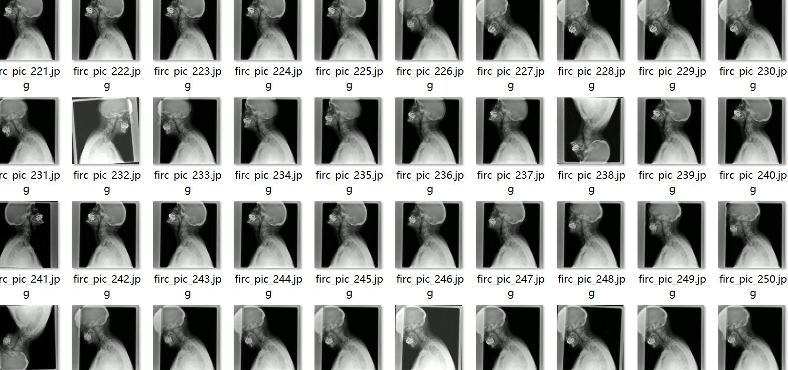
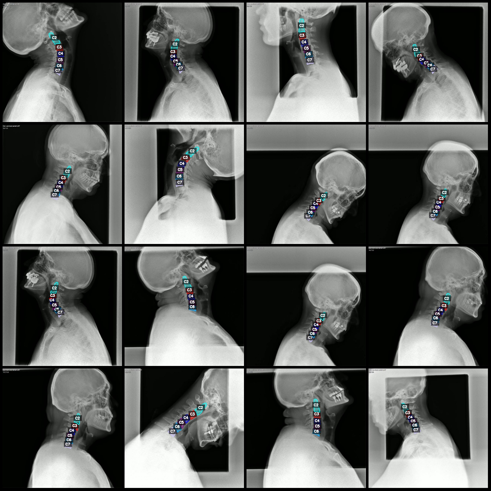

# Smart Medical Cervical Vertebra Segmentation Dataset (LabelMe format, 1054 images with 6 classes)

Dataset format: LabelMe format (excluding mask files, only including JPG images and corresponding JSON files)

Number of images (JPG file count): 1054
Number of annotations (JSON file count): 1054
Number of annotation categories: 6
Annotation category names: ["C2", "C3", "C4", "C5", "C6", "C7"]
Each category annotation count:
- C2 count = 1067
- C3 count = 1054
- C4 count = 1054
- C5 count = 1052
- C6 count = 1040
- C7 count = 965
Total box count: 6232

Using labeling tool: LabelMe v5.5.0
Image resolution: 640x640
Annotation rules: Draw polygons for each category

Important note: This dataset can be edited using LabelMe, but the JSON dataset needs to be converted into either Yolo or COCO format for semantic segmentation or instance segmentation.

Special declaration: The dataset does not guarantee the accuracy of the trained model or weight files.

Image preview:

Annotation example:

Original image (randomly selected 16 images):
Annotation drawing result:

## Images

Here is a pay link on Stripe ( https://buy.stripe.com/3cs8yP7sY87d0vu9AB ). Please contact me lonlonago@foxmail.com after funding $89, and I will send you a complete data files , thank you!

